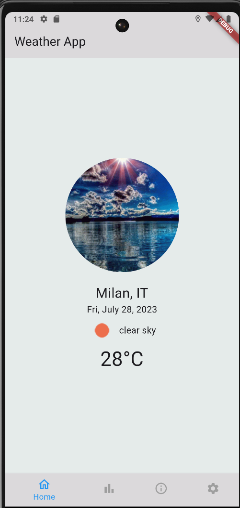

# Weather App For 1DV535

A weather app created by Erik Borgström (eb223fe).

## About

The project is made with the MVVM (Model-View-ViewModel) pattern, making the code easy to understand. The Views that need information from the ViewModel are subscribed to the ViewModel, meaning that they will update when the ViewModel lets them know that something has changed. 

I decided not to put my focus on hiding the API key as for this type of project with a very limited API key it didn't seem necessary. If however I would continue working on this app, the first thing to be added would be a way of making it secret.

The app updates the weather when position is changed automatically, so it is important to not change location more than 60 times/minute as this is the current limit of the API. For testing purposes this is fine. But if this app would launch I would have to add a caching or something to not make the app request everytime the position if for instance the user is out on a walk.

## Homepage

The homepage consist of the current forecast. And shows a gif depending on the weather code from the API. There is currently 6 different gifs.
* Group 2xx: Thunderstorm gif 

* Group 3xx & 5xx: Rain gif

* Group 6xx: Snow gif

* Group 7xx: Fog gif

* Group 800: Clear gif

* Group 80x: Clouds gif

So depending on these weather codes, the app will show different gifs as the images below demonstrate.

The homepage will also display the current weather icon, temperature, wind and weather description as well as the current date and location.
The unit on the temperature can be changed in the settings page and will change accordingly.

## Forecast

The forecast page is the page where you can see the future forecasts (5 days, three hours.).
The forecasts is displayed in a list of the different dates. If one date is pressed the hourly forecast for that date will be displayed. As shown in the images below.

The daily view displays the list with the days showing the highest temp during the day, wind, weather type and date. When it is expanded the hourly forecasts for that date will be shown displaying the time, the temperatures, weather type, weather icon and windspeed. The unit on the temperature can be changed in the settings page and will change accordingly.

## About

Well not much to say, it's an about page.

## Setting

On this page you can't do to much, but you can change the prefered unit in the app. You can select either, Kelvin, Celcius or Imperial. When changed the layout of the app will change accordingly with new units. The currently selected unit will be highlighted with blue.

To not having to fiddle to much with converting all the data, the app do make a new request to the API, so make sure to not spam the different units to much.

